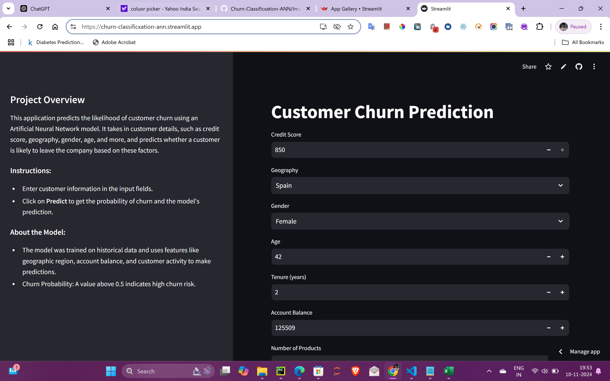
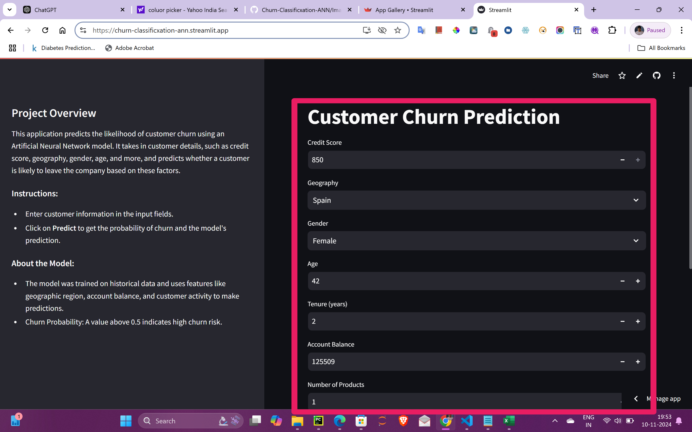
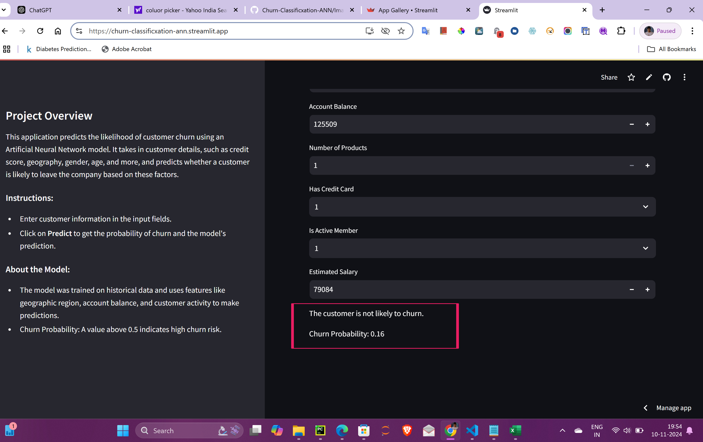

# Customer Churn Prediction using Artificial Neural Network (ANN)

[](https://opensource.org/licenses/MIT)

This project is designed to predict customer churn using an artificial neural network (ANN) model. The application allows users to input customer information, processes the data using pre-trained models and encoders, and displays the likelihood of churn. The project is implemented in Python, with a user-friendly interface built with [Streamlit](https://churn-classificxation-ann.streamlit.app/).

## Project Structure

```
Churn Classificxation ANN
├── DataSets                # Folder containing raw datasets
├── Models                  # Trained model and encoders
│   ├── label_encoder_gender.pkl
│   ├── model.h5
│   ├── onehot_encoder_geo.pkl
│   └── scaler.pkl
├── Notebooks               # Jupyter notebooks for data processing and model training
│   ├── logs
│   ├── Data Ingestion & Cleaning.ipynb
│   ├── Model Building & Evaluation.ipynb
│   └── Prediction.ipynb
├── .gitignore              # Specifies files to ignore in Git
├── Application.py          # Main Streamlit app code
└── requirements.txt        # Dependencies for the project
```

## Notebooks

1. **Data Ingestion & Cleaning.ipynb**: Preprocessing steps for handling missing values, encoding categorical variables, and feature scaling.
2. **Model Building & Evaluation.ipynb**: Training and evaluating the artificial neural network model.
3. **Prediction.ipynb**: Model testing on sample data for performance analysis.

## Application

The Streamlit app allows users to predict customer churn by providing customer information. The model processes the input data and outputs a churn prediction and probability.

Try it out here: [Customer Churn Prediction App](https://churn-classificxation-ann.streamlit.app/)

### Features

- **Customer Information Input**: Enter key customer attributes like credit score, geography, gender, and more.
- **Churn Prediction**: The model predicts whether the customer is likely to churn.
- **Churn Probability**: Displays the probability score of the prediction.

## Getting Started

### Prerequisites

Make sure to have the following installed:
- Python 3.7+
- Streamlit
- TensorFlow
- Pandas
- Numpy
- Scikit-learn

### Installation

1. Clone the repository:
   ```bash
   git clone https://github.com/ Kumar19Aditya/Churn-Classification-ANN.git
   cd Churn-Classification-ANN
   ```

2. Install the required packages:
   ```bash
   pip install -r requirements.txt
   ```

3. Run the application:
   ```bash
   streamlit run Application.py
   ```

## Model and Data Processing

- **Artificial Neural Network (ANN)**: A neural network model trained to predict churn probability based on customer features.
- **Encoders and Scaler**: Categorical variables like geography and gender are encoded using pre-trained encoders, and features are scaled for model compatibility.

### Sample Screenshots

#### 1. Home Page  
[]

#### 2. Customer Input Form  
[]

#### 3. Prediction Results  
[]


## License

This project is licensed under the MIT License - see the [LICENSE](LICENSE) file for details.

---

Let me know if you’d like any further customization!
